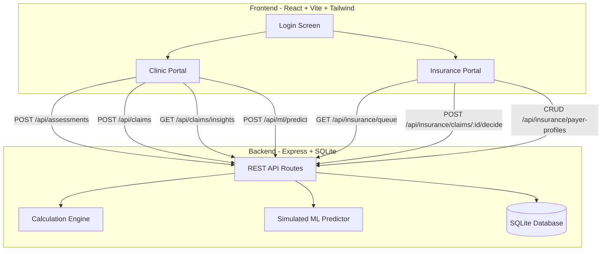

# ABA Medical Necessity Calculator -- Demo Prototype Build Plan

## Context

The repo contains a detailed [contract](contracts/ABA_Medical_Necessity_Calculator_Contract.md) for a dual-tenant ABA therapy dosage determination system, plus a fully functional single-file React prototype ([`mock app/aba_calculator.jsx`](mock%20app/aba_calculator.jsx)) that already implements the complete 7-step dosage algorithm, both portal UIs, and the claims pipeline -- all in-memory with no backend. The goal is to turn this into a proper, structured demo prototype with data persistence.

---

## Architecture (Demo)

Since this is a **demo/prototype only**, we will simplify production requirements significantly:

- **No real HIPAA compliance**, physical DB isolation, or MFA -- just demo-grade auth
- **No real ML model** -- use a deterministic heuristic that simulates approval probability
- **Single SQLite database** with logical tenant separation (not physical isolation)
- All runs locally with `npm run dev`



---

## Tech Stack

| Layer | Choice | Reason |
|-------|--------|--------|
| Frontend | React 18 + Vite | Fast dev, matches contract recommendation |
| Styling | Tailwind CSS | Contract specifies Tailwind; dark theme tokens map cleanly |
| State | Zustand | Lightweight, good for demo |
| Backend | Express.js | Simple REST API, no SSR needed for demo |
| Database | SQLite via `better-sqlite3` | Zero-config, file-based, perfect for demo |
| Auth | Mock/simulated | Role selection like current prototype, with session cookie |

---

## Step-by-Step Build

### Phase 1: Project Scaffolding

- Initialize a Vite + React + TypeScript project in the repo root
- Install dependencies: `tailwindcss`, `zustand`, `react-router-dom`, `lucide-react` (icons)
- Configure Tailwind with the design tokens from the contract (Section 10.1): background `#0B0E14`, card `#13161F`, clinic green `#3DDC84`, insurance purple `#A78BFA`, etc.
- Set up folder structure:

```
src/
  components/       # Shared UI primitives (Field, RatingRow, Badge, Meter, etc.)
  features/
    clinic/         # Calculator, Claims, Insights, ML Predictor tabs
    insurance/      # Queue, PolicyCalc, Decisions, PolicyConfig tabs
    auth/           # Login screen
  lib/
    calculator.ts   # 7-step dosage engine (extracted from mock)
    api.ts          # API client
  stores/           # Zustand stores
server/
  index.ts          # Express server entry
  routes/           # API route handlers
  db/               # SQLite schema + seed
  calculator.ts     # Server-side calculation engine (shared logic)
```

### Phase 2: Extract and Modularize the Calculation Engine

Port the calculation functions from `mock app/aba_calculator.jsx` (lines 40-69: `calcVineland`, `calcVBMAPP`, `calcFII`, `fiiBase`, `calcBeh`, `calcEnv`, `runCalc`) into a shared TypeScript module (`src/lib/calculator.ts`). This engine is used identically by both portals -- the insurance version just passes custom payer weights. The calculation logic must match the contract Section 4 exactly.

### Phase 3: Build the Backend

- **Database schema**: Create SQLite tables mirroring the contract Section 13, simplified to a single database with a `tenant_type` column for logical separation:
  - `users`, `organizations`, `assessments`, `claims`, `payer_profiles`, `audit_log`
- **Seed data**: Pre-populate a demo clinic org, demo insurance org, one default payer profile, and 5-10 sample claims (mix of pending/approved/denied) so the demo has data on first load
- **API routes**: Implement the endpoints from contract Section 14 (simplified for demo -- no real auth middleware, just a role header)
- **Simulated ML predictor**: A heuristic function that estimates approval probability based on FII score, risk score, requested hours, and tier -- no actual model training, but mimics realistic output with confidence bands

### Phase 4: Build the Frontend -- Shared Components

Extract the UI primitives from the mock JSX into proper React components with Tailwind:

- `Field`, `Input`, `Select` -- form primitives
- `RatingRow` -- 0-4 button selector with color coding
- `Chips` -- toggle chips for multi-select
- `Section` -- collapsible numbered section
- `Badge`, `Meter` -- display components
- `ResultsPanel` -- the big hour display with tier, supervision, goals, flags, breakdown

### Phase 5: Build the Frontend -- Clinic Portal

Four tabs matching contract Section 3.2:

1. **Calculator Tab**: Full 11-section assessment form (extracted from mock JSX lines 129-174). Calls backend `/api/assessments` to calculate and save. Renders `ResultsPanel` with results.
2. **ML Predictor Tab**: Before claim submission, calls `/api/ml/predict` and displays a probability gauge, gap analysis card with weaknesses, and actionable recommendations.
3. **My Claims Tab**: Fetches from `/api/claims`, shows status cards with stats grid (Total/Pending/Approved/Denied). Displays insurance notes when decisions arrive.
4. **Insights Tab**: Fetches from `/api/claims/insights`, shows approval rate, FII/hours comparisons, risk documentation gaps, and actionable tips.

### Phase 6: Build the Frontend -- Insurance Portal

Four tabs matching contract Section 3.3:

1. **Review Queue Tab**: Fetches pending claims from `/api/insurance/queue`. Shows summary cards with key metrics. Click to open detailed review view with override hours, notes field, and approve/deny buttons.
2. **Policy Calculator Tab**: Same assessment form but calls backend with custom payer weights from the active payer profile.
3. **Decisions Tab**: History list of all decided claims with notes and outcome.
4. **Policy Config Tab**: Form to edit payer profile weights (FII, Vineland, VB-MAPP, Behavioral, Environmental weights, age multipliers, supervision %, parent training range, min/max hours). Saves to `/api/insurance/payer-profiles`.

### Phase 7: Polish and Demo Prep

- Add `concurrently` to run both frontend dev server and backend in one command (`npm run dev`)
- Seed realistic demo data (10+ claims in various states)
- Ensure the claims pipeline works end-to-end: clinic submits -> appears in insurance queue -> insurance decides -> status + notes flow back to clinic -> insights update
- Add the Caregiver Burden assessment (Section 10 of the form, 9 domains)
- Verify calculation engine against contract Section 4 edge cases (high-risk override, caps, rounding)

---

## Key Files That Will Be Created

| File | Purpose |
|------|---------|
| `package.json` | Root package with all dependencies |
| `vite.config.ts` | Vite config with proxy to backend |
| `tailwind.config.ts` | Design tokens from contract Section 10.1 |
| `src/lib/calculator.ts` | Shared 7-step dosage engine |
| `src/lib/mlPredictor.ts` | Client-side ML result display logic |
| `server/index.ts` | Express server entry point |
| `server/db/schema.sql` | SQLite schema |
| `server/db/seed.sql` | Demo seed data |
| `server/routes/*.ts` | API route handlers |
| `src/features/auth/LoginScreen.tsx` | Dual-portal login |
| `src/features/clinic/*.tsx` | All 4 clinic tabs |
| `src/features/insurance/*.tsx` | All 4 insurance tabs |
| `src/components/*.tsx` | Shared UI components |

---

## Implementation Todos

| # | Task | Dependencies |
|---|------|-------------|
| 1 | Initialize Vite + React + TS project with Tailwind, Zustand, Express, SQLite deps | -- |
| 2 | Extract and port the 7-step dosage calculation engine to shared TypeScript module | 1 |
| 3 | Create SQLite schema, seed data, and Express server with all API routes | 1 |
| 4 | Build shared UI component library (Field, RatingRow, Chips, Section, Badge, Meter, ResultsPanel) | 1 |
| 5 | Build Clinic Portal: Calculator, ML Predictor, My Claims, and Insights tabs | 2, 3, 4 |
| 6 | Build Insurance Portal: Review Queue, Policy Calculator, Decisions, Policy Config tabs | 2, 3, 4 |
| 7 | Wire up end-to-end claims pipeline: submit -> review -> decide -> status sync -> insights | 5, 6 |
| 8 | Polish UI, seed realistic demo data, verify calculation edge cases, add dev script | 7 |

---

## What Is Explicitly Deferred (Not Demo Scope)

- Real authentication (Auth0/Clerk/MFA)
- Physical database isolation (separate DB instances)
- Real ML model training (scikit-learn microservice)
- PDF report generation
- HIPAA compliance / encryption at rest
- Email notifications
- HL7 FHIR integration
- Multi-organization support
