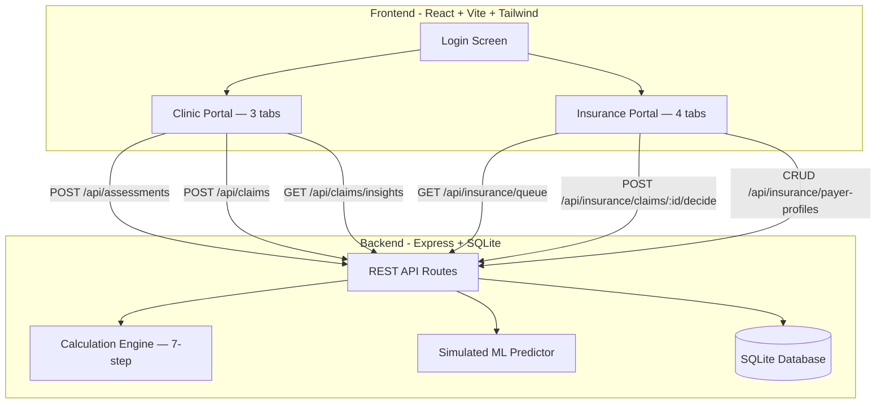

# ABA Medical Necessity Calculator — Demo Prototype Build Plan (Revised)

## Context

The repo contains a detailed [contract](contracts/ABA_Medical_Necessity_Calculator_Contract.md) for a dual-tenant ABA therapy dosage determination system, plus a fully functional single-file React prototype ([`mock app/aba_calculator.jsx`](mock%20app/aba_calculator.jsx)) that already implements the complete 7-step dosage algorithm, both portal UIs, and the claims pipeline — all in-memory with no backend. The goal is to turn this into a proper, structured demo prototype with data persistence.

### Source Documents

| File | Purpose | Use During Build |
|------|---------|-----------------|
| `ABA_Medical_Necessity_Calculator_Contract.md` | Authoritative spec — algorithm, architecture, data model, UI tokens | **Primary reference for all implementation decisions** |
| `Medical_Necessity_Dosage_Tool_Developer_Specification.pdf` | Dosage algorithm detail — input questions, hour adjustment tables | Verify calculation engine logic |
| `ABA_Medical_Necessity_Survey_Reference.pdf` | Complete 50+ question survey with all options and scoring | Reference for form field options and validation ranges |
| `BRD_ABA_Medical_Necessity_Calculator.docx` | Business requirements, user stories, acceptance criteria | Context for why features exist |
| `aba_medical_necessity_survey.html` | Original HTML survey prototype (basic calculation, NOT the full algorithm) | **Do not use as form structure reference** — use contract Section 6 instead |
| `mock app/aba_calculator.jsx` | React prototype with full algorithm and both portals | Extract calculation engine; reference for UI patterns |

> **Important:** When the survey HTML and the contract disagree on form structure, the contract wins. The HTML survey lumps assessments into a single section; the contract separates Vineland-3 and VB-MAPP into distinct scored sections.

---

## Architecture (Demo)

Since this is a **demo/prototype only**, we simplify production requirements significantly:

- **No real HIPAA compliance**, physical DB isolation, or MFA — just demo-grade auth
- **No real ML model** — use a deterministic heuristic that simulates approval probability
- **Single SQLite database** with logical tenant separation (not physical isolation)
- All runs locally with `npm run dev`



---

## Tech Stack

| Layer | Choice | Reason |
|-------|--------|--------|
| Frontend | React 18 + Vite | Fast dev, matches contract recommendation |
| Styling | Tailwind CSS | Contract specifies Tailwind; dark theme tokens map cleanly |
| State | Zustand | Lightweight, good for demo |
| Backend | Express.js | Simple REST API, no SSR needed for demo |
| Database | SQLite via `better-sqlite3` | Zero-config, file-based, perfect for demo |
| Auth | Mock/simulated | Role selection like current prototype, with session cookie |

---

## Key Decisions & Clarifications

Before building, the developer should be aware of these resolved ambiguities:

### 1. Form Sections: 8 sections, not 11

The contract (Section 6) defines **8 assessment form sections**. The survey reference PDF has 11 sections, but several of those (demographics, diagnosis info, service history, service delivery, additional info) collect contextual data without feeding into the scored calculation steps. The form must follow the contract's 8-section structure:

| Section # | Name | Feeds Into Algorithm Step |
|-----------|------|--------------------------|
| 1 | Client Demographics | Age multiplier (Step 6) |
| 2 | Vineland-3 Assessment | Step 2: Vineland adjustment |
| 3 | VB-MAPP Assessment | Step 3: VB-MAPP adjustment |
| 4 | Functional Impairment Index (9 domains, 0–4 each) | Step 1: FII → base hours |
| 5 | Skill Deficit Domains (8 checkboxes) | Treatment goal count |
| 6 | Behavioral Risk Modifiers | Step 4: Behavioral adjustment |
| 7 | Environmental Modifiers (7 checkboxes) | Step 5: Environmental adjustment |
| 8 | Risk Assessment (6 factors, 0–4 each) | Clinical flags, high-risk override |

Additional contextual fields (diagnosis, educational setting, living situation, service history, service delivery preferences, co-occurring diagnoses, etc.) should be collected within the relevant sections above — primarily Section 1 (Demographics) — but do **not** constitute separate numbered sections.

### 2. Clinic Portal: 3 tabs, not 4

The contract (Section 3.2) specifies **3 clinic tabs**: Calculator, My Claims, Insights. The original build plan added an ML Predictor as a 4th tab. Instead, integrate the ML prediction as a **pre-submission step within the Calculator tab**:

1. User fills out assessment form → clicks "Calculate"
2. Results panel displays (hours, tier, flags, breakdown)
3. Below results, a "Predict Approval" button calls the ML heuristic
4. Prediction result (probability gauge, gap analysis, tips) renders inline
5. User can then "Submit as Claim" from the same view

This keeps the tab structure aligned with the contract while preserving the ML feature.

### 3. Caregiver Burden: Deferred (matches contract)

The Caregiver Burden assessment (9 domains, 0–36 scale) is fully designed in the survey reference (Section 7), but the contract explicitly lists it as a **Phase 2 enhancement** (Section 16). It does NOT feed into the current 7-step calculation engine.

**For this demo build: do not include the Caregiver Burden section in the form.** If the client later wants it pulled forward, it will need a defined role in the algorithm (e.g., a new Step 8 or integration into the Environmental adjustment) before it can be meaningfully included.

### 4. Vineland-3 and VB-MAPP are separate form sections

The original HTML survey lumps all assessments into one section. The contract and the dosage algorithm treat these as distinct inputs with separate hour adjustment caps (+12 hrs each). The form must present them as **Section 2 (Vineland-3)** and **Section 3 (VB-MAPP)** — separate collapsible sections with their own validation.

### 5. Seed data: one comprehensive seed, not two passes

Seed the database once with **12–15 claims** covering all important scenarios:

| Scenario | Count | Purpose |
|----------|-------|---------|
| Pending claims | 4 | Populate insurance review queue |
| Approved claims | 4 | Populate decisions history, enable insights |
| Denied claims | 4 | Enable insights (FII gaps, hours gaps, risk patterns) |
| Edge cases | 2–3 | High-risk override, age multiplier boundaries, max cap hits |

Claims should span multiple age ranges (0–5, 6–12, 13+), all three tiers, and include at least one case with clinical flags. This ensures the demo tells a complete story from first launch — both portals have meaningful data, and the insights tab can surface real patterns.

---

## Step-by-Step Build

### Phase 1: Project Scaffolding

- Initialize a Vite + React + TypeScript project in the repo root
- Install dependencies: `tailwindcss`, `zustand`, `react-router-dom`, `lucide-react` (icons)
- Configure Tailwind with the design tokens from the contract (Section 10.1): background `#0B0E14`, card `#13161F`, clinic green `#3DDC84`, insurance purple `#A78BFA`, etc.
- Set up folder structure:

```
src/
  components/       # Shared UI primitives (Field, RatingRow, Badge, Meter, etc.)
  features/
    clinic/         # Calculator, Claims, Insights tabs
    insurance/      # Queue, PolicyCalc, Decisions, PolicyConfig tabs
    auth/           # Login screen
  lib/
    calculator.ts   # 7-step dosage engine (extracted from mock)
    mlPredictor.ts  # Deterministic heuristic for approval prediction
    api.ts          # API client
  stores/           # Zustand stores
server/
  index.ts          # Express server entry
  routes/           # API route handlers
  db/               # SQLite schema + seed
  calculator.ts     # Server-side calculation engine (shared logic)
```

### Phase 2: Extract and Modularize the Calculation Engine

Port the calculation functions from `mock app/aba_calculator.jsx` into a shared TypeScript module (`src/lib/calculator.ts`). This engine is used identically by both portals — the insurance version just passes custom payer weights.

**Critical: verify the ported engine against the contract Section 4 tables, not just the mock JSX.** The mock may have implementation quirks. The contract is authoritative for:

- FII → base hours mapping (Section 4.1)
- Vineland adjustment rules and +12 cap (Section 4.2)
- VB-MAPP adjustment rules and +12 cap (Section 4.3)
- Behavioral risk adjustment and +16 cap (Section 4.4)
- Environmental adjustment and +8 cap (Section 4.5)
- Age multiplier with high-risk override logic (Section 4.6)
- Final calculation: round to nearest 5, clamp 10–40 (Section 4.7)

Also port the **output derivations** (Section 4.8):
- Case Intensity Tier: Tier 1 (<20h), Tier 2 (20–29h), Tier 3 (30+h)
- BCBA Supervision: Tier 1 = 10%, Tier 2 = 15%, Tier 3 = 20% of direct hours
- Parent Training: Tier-based within payer range (default 2–8 hrs/mo)
- Treatment Goals: Based on skill deficit count + FII severity (min 2, max 12)
- Clinical Flags: HIGH RISK, Severe Impairment, Behavioral Risk, Environmental Stressors

### Phase 3: Build the Backend

- **Database schema**: Create SQLite tables mirroring the contract Section 13, simplified to a single database with a `tenant_type` column for logical separation:
  - `users`, `organizations`, `assessments`, `claims`, `payer_profiles`, `audit_log`
- **Seed data**: Pre-populate with:
  - 1 demo clinic organization, 1 demo insurance organization
  - 2 clinic users (reviewer, admin), 2 insurance users (reviewer, admin)
  - 1 default payer profile with standard weights (all 1.0)
  - 12–15 sample claims as described in "Key Decisions #5" above
- **API routes**: Implement the endpoints from contract Section 14 (simplified for demo — no real auth middleware, just a role header):

```
POST   /api/auth/login          — Mock login (role selection)
POST   /api/auth/logout

# Clinic endpoints
POST   /api/assessments         — Run calculator, save assessment
GET    /api/assessments          — List clinic's assessments
POST   /api/claims              — Submit claim from assessment
GET    /api/claims              — List clinic's claims with status
GET    /api/claims/insights     — Get learning insights

# Insurance endpoints
GET    /api/insurance/queue          — Get pending claims
GET    /api/insurance/claims/:id     — Get full claim details
POST   /api/insurance/claims/:id/decide  — Approve or deny
GET    /api/insurance/decisions      — Decision history
POST   /api/insurance/calculate      — Run enhanced calculator with payer weights
GET    /api/insurance/payer-profiles — List payer configs
POST   /api/insurance/payer-profiles — Create/update config
```

- **Simulated ML predictor**: A server-side heuristic function (`/api/ml/predict`) that estimates approval probability based on FII score, risk score, requested hours, and tier. No actual model training — deterministic logic that mimics realistic output with confidence bands and gap analysis.

### Phase 4: Build the Frontend — Shared Components

Extract the UI primitives from the mock JSX into proper React components with Tailwind:

- `Field`, `Input`, `Select` — form primitives with validation states
- `RatingRow` — 0–4 button selector with color coding (green → yellow → red)
- `Chips` — toggle chips for multi-select (skill deficits, behavior types)
- `Section` — collapsible numbered section with completion indicator
- `Badge`, `Meter` — display components
- `ResultsPanel` — the large hour display with tier, supervision, goals, flags, step-by-step breakdown
- `PredictionPanel` — approval probability gauge, gap analysis, tips (used inline in Calculator tab)

### Phase 5: Build the Frontend — Clinic Portal

**Three tabs** matching contract Section 3.2:

1. **Calculator Tab**
   - Full **8-section** assessment form following contract Section 6:
     - Section 1: Client Demographics (age, diagnosis, educational setting, living situation, co-occurring diagnoses, service history, service delivery preferences — contextual fields grouped here)
     - Section 2: Vineland-3 Assessment (4 domain scores + optional composite)
     - Section 3: VB-MAPP Assessment (milestones, barriers, optional transition)
     - Section 4: Functional Impairment Index (9 domains, each rated 0–4, live FII total displayed)
     - Section 5: Skill Deficit Domains (8 checkboxes)
     - Section 6: Behavioral Risk Modifiers (aggression freq, self-injury severity, elopement, crisis events)
     - Section 7: Environmental Modifiers (7 checkboxes, each +2 hrs, capped at +8)
     - Section 8: Risk Assessment (6 factors, each rated 0–4, total 0–24)
   - "Calculate" button → calls backend `/api/assessments` → renders `ResultsPanel` with results
   - Below results: "Predict Approval" button → calls `/api/ml/predict` → renders `PredictionPanel` inline with probability gauge, gap analysis, and actionable tips
   - "Submit as Claim" button → calls `/api/claims` → navigates to My Claims tab

2. **My Claims Tab**
   - Fetches from `/api/claims`
   - Stats grid at top: Total / Pending / Approved / Denied counts
   - List of claim cards showing: claim ID, patient name, requested hours, tier, status badge, submitted date
   - Expanded view shows: insurance notes, approved hours (if decided), full rationale

3. **Insights Tab**
   - Fetches from `/api/claims/insights`
   - Approval rate with progress bar
   - FII comparison: average FII of denied vs approved claims
   - Hours comparison: average requested hours for denied vs approved
   - Risk documentation gaps: count of denials where risk score < 10
   - Actionable tips derived from patterns (e.g., "Denied claims average 28 hrs requested vs 18 hrs approved — strengthen documentation for high-hour requests")

### Phase 6: Build the Frontend — Insurance Portal

**Four tabs** matching contract Section 3.3:

1. **Review Queue Tab**
   - Fetches pending claims from `/api/insurance/queue`
   - Summary cards with key metrics at a glance: requested hours, tier badge, FII score, risk score, clinical flags
   - Click to open detailed review view:
     - Full assessment data and rationale text
     - Override hours input field
     - Notes text area
     - Approve / Deny buttons
   - Decision calls `/api/insurance/claims/:id/decide`

2. **Policy Calculator Tab**
   - Same 8-section assessment form as clinic portal
   - Uses the active payer profile's custom weights when calculating
   - Calls `/api/insurance/calculate` instead of `/api/assessments`
   - Results panel shows calculation with payer-adjusted values

3. **Decisions Tab**
   - History list of all decided claims
   - Shows: claim ID, patient, requested vs approved hours, status, decision date, reviewer notes

4. **Policy Config Tab**
   - Form to edit payer profile parameters (contract Section 4.9):
     - Domain weight multipliers: FII, Vineland, VB-MAPP, Behavioral, Environmental (each 0–2, default 1.0)
     - Age multipliers: 0–5 / 6–12 / 13+ (defaults: 1.2 / 1.0 / 0.85)
     - Hour range: min (5–20, default 10) and max (10–50, default 40)
     - Supervision percentage (5–30%, default 15%)
     - Parent training range (configurable, default 2–8 hrs/mo)
   - Saves to `/api/insurance/payer-profiles`
   - Changes take effect immediately for the Policy Calculator tab

### Phase 7: Integration & Polish

- Add `concurrently` to run both frontend dev server and backend in one command (`npm run dev`)
- Wire up end-to-end claims pipeline and verify:
  1. Clinic fills form → calculates → submits claim
  2. Claim appears in insurance review queue
  3. Insurance reviews → approves or denies with notes
  4. Status + notes flow back to clinic's My Claims tab
  5. Insights tab updates with new approval/denial data
- Verify calculation engine against contract Section 4 edge cases:
  - High-risk override (Risk Score ≥ 15 OR severe self-injury → age multiplier forced to ×1.0)
  - All adjustment caps hit simultaneously (Vineland +12, VB-MAPP +12, Behavioral +16, Environmental +8)
  - Rounding to nearest 5-hour increment
  - Min/max clamping (10–40 default, configurable per payer)
  - Payer weight multipliers scaling each adjustment independently
- Verify seed data produces meaningful insights (approval rate, FII gaps, hours gaps visible)
- Test both portals with fresh browser sessions to confirm role isolation

---

## Key Files That Will Be Created

| File | Purpose |
|------|---------|
| `package.json` | Root package with all dependencies |
| `vite.config.ts` | Vite config with proxy to backend |
| `tailwind.config.ts` | Design tokens from contract Section 10.1 |
| `src/lib/calculator.ts` | Shared 7-step dosage engine |
| `src/lib/mlPredictor.ts` | Deterministic approval prediction heuristic |
| `src/lib/api.ts` | API client for all backend calls |
| `server/index.ts` | Express server entry point |
| `server/db/schema.sql` | SQLite schema (users, orgs, assessments, claims, payer_profiles, audit_log) |
| `server/db/seed.sql` | Comprehensive demo seed data (12–15 claims across all scenarios) |
| `server/routes/auth.ts` | Mock auth routes |
| `server/routes/clinic.ts` | Clinic API routes (assessments, claims, insights) |
| `server/routes/insurance.ts` | Insurance API routes (queue, decide, payer-profiles, calculate) |
| `server/routes/ml.ts` | ML prediction endpoint |
| `server/calculator.ts` | Server-side calculation engine |
| `src/features/auth/LoginScreen.tsx` | Dual-portal login with role selection |
| `src/features/clinic/CalculatorTab.tsx` | 8-section form + results + ML prediction |
| `src/features/clinic/ClaimsTab.tsx` | Claims list with status tracking |
| `src/features/clinic/InsightsTab.tsx` | Learning insights dashboard |
| `src/features/insurance/QueueTab.tsx` | Pending claims review queue |
| `src/features/insurance/PolicyCalcTab.tsx` | Calculator with payer weights |
| `src/features/insurance/DecisionsTab.tsx` | Decision history |
| `src/features/insurance/PolicyConfigTab.tsx` | Payer profile configuration |
| `src/components/*.tsx` | Shared UI components (Field, RatingRow, Chips, Section, Badge, Meter, ResultsPanel, PredictionPanel) |
| `src/stores/*.ts` | Zustand stores (auth, clinic, insurance) |

---

## Implementation Todos

| # | Task | Dependencies | Notes |
|---|------|-------------|-------|
| 1 | Initialize Vite + React + TS project with Tailwind, Zustand, Express, SQLite deps | — | Include `concurrently` for dev script |
| 2 | Extract and port the 7-step dosage calculation engine to shared TypeScript module | 1 | **Verify against contract Section 4, not just mock JSX** |
| 3 | Create SQLite schema, comprehensive seed data (12–15 claims), and Express server with all API routes | 1 | Single seed pass, all scenarios covered |
| 4 | Build shared UI component library (Field, RatingRow, Chips, Section, Badge, Meter, ResultsPanel, PredictionPanel) | 1 | |
| 5 | Build Clinic Portal: Calculator (8 sections + inline ML prediction), My Claims, and Insights tabs | 2, 3, 4 | **3 tabs, not 4** — ML prediction is inline |
| 6 | Build Insurance Portal: Review Queue, Policy Calculator, Decisions, Policy Config tabs | 2, 3, 4 | 4 tabs per contract |
| 7 | Wire up end-to-end claims pipeline: submit → review → decide → status sync → insights | 5, 6 | Test full flow both directions |
| 8 | Verify edge cases, test with seed data, polish UI, finalize dev script | 7 | High-risk override, caps, rounding, payer weights |

---

## What Is Explicitly Deferred (Not Demo Scope)

- Real authentication (Auth0/Clerk/MFA)
- Physical database isolation (separate DB instances)
- Real ML model training (scikit-learn microservice)
- PDF report generation (Executive Summary, Clinical Justification, Audit Appendix)
- HIPAA compliance / encryption at rest
- Email notifications
- HL7 FHIR integration
- Multi-organization support
- Caregiver Burden assessment (9-domain, 0–36 scale) — fully designed in survey reference but no algorithm role defined; deferred per contract Section 16
- ABLLS-R and AFLS assessment scoring integration — deferred per contract Section 16
- Mobile application
- Multi-language support
